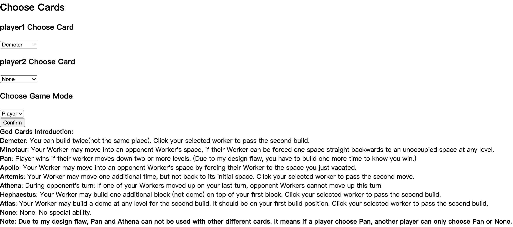
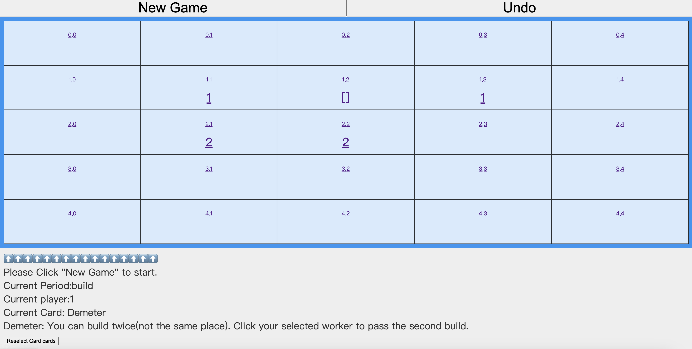
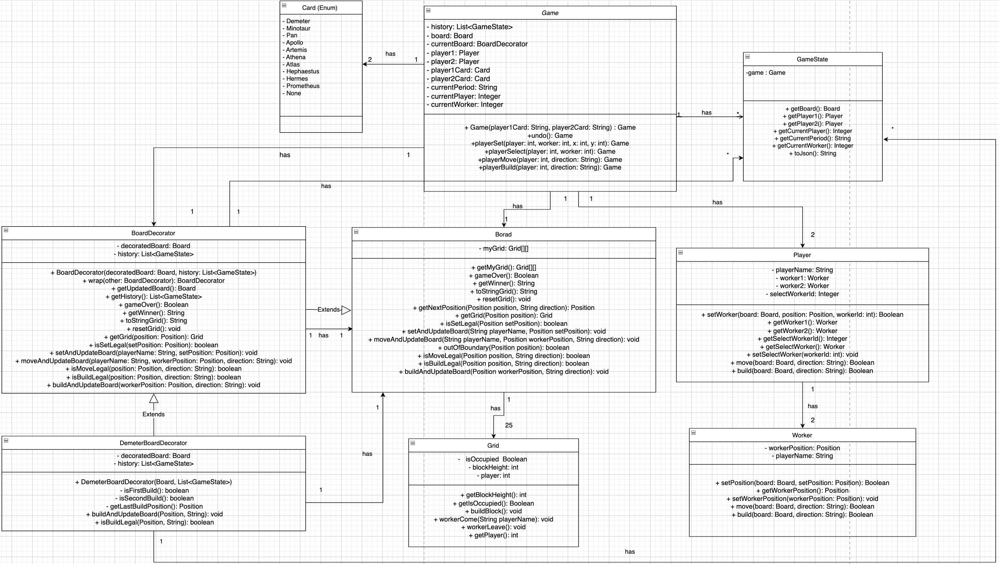
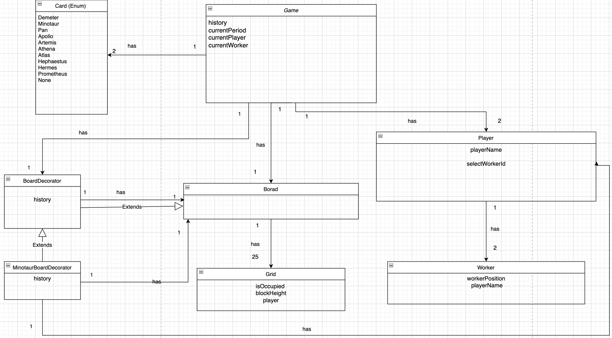
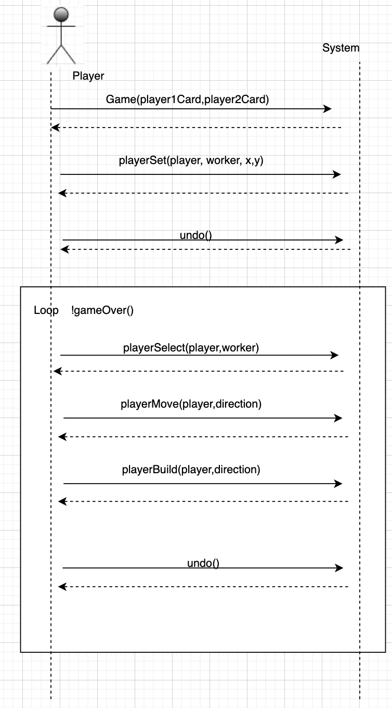

## To start the game:
* To install settings:
    * run "npm install" in front-end folder
    * run "mvn install"
* Run Game:
    * 1.run App.java file.
    * 2.run "npm start" in front-end path. 
Then you can operate the game basically by clicking your mouse!
Click grids to select, move and build.
Remember to follow the guidance under the board.
Click "new game" to start a new game.

## Rules
Santorini has very simple rules: The game is played on a 5 by 5 grid, where each grid can contain towers consisting of blocks and domes. Two players have two workers each on any field of the grid. Throughout the game, the workers move around and build towers. The first worker to make it on top of a level-3 tower wins. Note that though the official rules require that if a player cannot further move any worker, she/he will lose, you don't need to consider this as a winning condition in this homework. You also don’t need to handle more than two players.

As set up, both players pick starting positions for both their workers on the grid. Players take turns. In each turn, they select one of their workers, move this worker to an adjacent unoccupied field, and afterward add a block or dome to an unoccupied adjacent field of their new position. Locations with a worker or a dome are considered occupied. Workers can only climb a maximum of one level when moving. Domes can only be built on level-3 towers. You can assume there are infinite pieces to play.

## God Cards
Demeter, Minotaur, Pan, Apollo, Artemis, Athena, Hephaestus, Atlas

## Undo
I have added a GameState class to store the game state, and defined a history list in Game to store GameState objects. Each time a player makes an operation, only change a copy of game object based on the latest GameState, after the operation, add it to the history list. I ensure immutability by creating a new copy of the game each time and storing only copies in the history list.
When returning the latest game state to the frontend, I also use a copied version of the state to prevent users from making changes to the original state.
Define GameState as final, define the game object in GameState as final private.

## AI
When select gods card, choose "AI" as Game Mode to player with AI. Since AI now is the player2, AI can use the god card you chose for player2.
The implementation is front end act as the second player, when it is the second player's turn, it keep sending random play request to back end until it is accepted by back-end. It is absolutely a working AI that can play the basic game against a human and can be selected in the user interface and also can make use of the god cards!

## Overview

